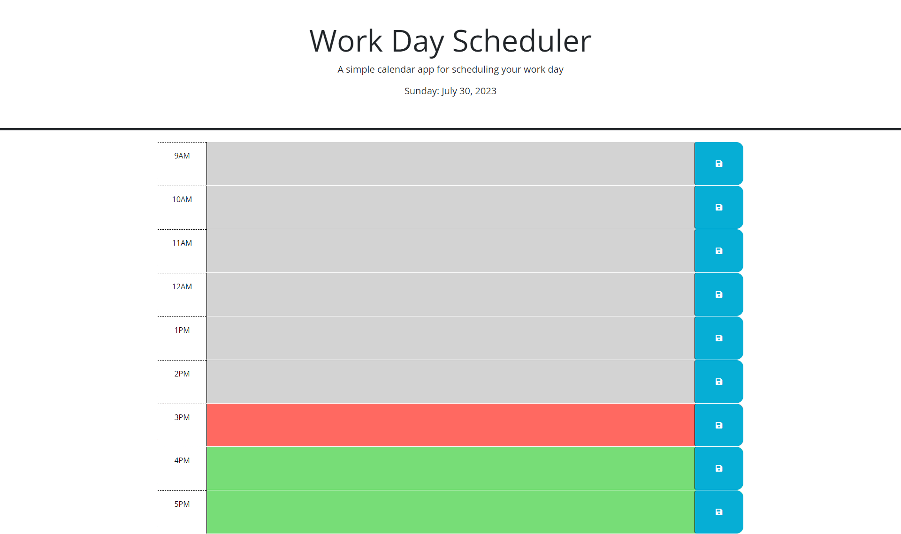

# Work Day Scheduler

This is a simple online app that allows the user to add important events to a Work Day Scheduler. Events that appear gray are in the past, current events will appear red, and future events will appear blue. You can save your events by clicking the blue save button on the right side of the page. Once the events are saved then they will remain on the scheduler when the page is reloaded.

## Mock-Up

The following image shows the web application's appearance and functionality:

Link to application https://ricky-sama.github.io/Work-Day-Scheduler/